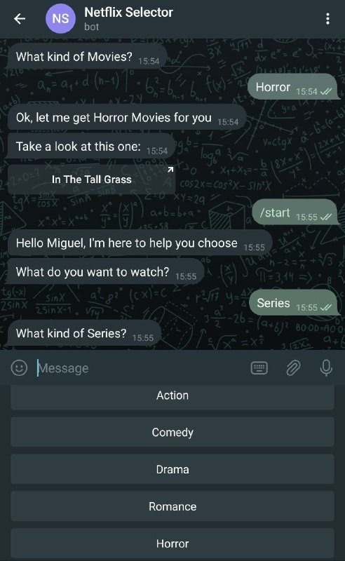

# Netflix-Chooser-Bot

In this project I created a Telegram bot capable of choosing a random movie or serie by asking the user what he wants to watch.

> I built it using Ruby and the Telegram Bot API

## Built With

- Ruby
- Telegram Bot API
- Rspec & Rubocop

## Getting Started

To get a local copy up and running follow these simple steps.

### Prerequisites

- Web Browser or Telegram app
- Code Editor
- Terminal

### Install

The first step to run this bot on your pc is to clone this repo using the following command on your terminal:

- `$git clone https://github.com/Miguelus373/Netflix-Chooser-Bot.git`

After that, you need to install all the neccesary gems for this bot:

- On your terminal, navigate to the folder where the repo is
- Run `bundle install`

### Usage

Once you have the repo and its gems locally you need to start the bot.

- On your terminal, navigate to the folder where the repo is
- Run `ruby bin/main.rb`

## Testing

In case you want to test the different methods and classes of this project you just need to open a terminal on the repo folder and run `rspec`. This will display all the default tests for this repo.

> If you want to add your own tests, go to the spec folder and find the class you want to add tests for

## Telegram

After the previous steps the bot is ready to be used.

> Just go to the [Telegram](https://web.telegram.org/) webpage or use the app, then search for [@NetflixSelectorBot](https://web.telegram.org/#/im?p=@NetflixSelectorBot)

### Bot Commands:

- To start the bot just type `/start` and press send. The bot will ask you a couple of question to give you the best movie/serie recomendation
- Once the bot has helped you to select something to watch, you can stop the bot by typing `/stop`

## Author

👤 **Miguel Uzcátegui**

- Github: [@Miguelus373](https://github.com/Miguelus373)
- Linkedin: [Miguel-Uzcátegui](https://www.linkedin.com/in/miguelus/)

## 🤝 Contributing

Contributions, issues and feature requests are welcome!

Feel free to check the [issues page](https://github.com/Miguelus373/Netflix-Chooser-Bot/issues).

## Show your support

Give a ⭐️ if you like this project!

## Acknowledgments

- Hat tip to anyone whose code was used

## 📝 License

This project is [MIT](LICENSE) licensed.
